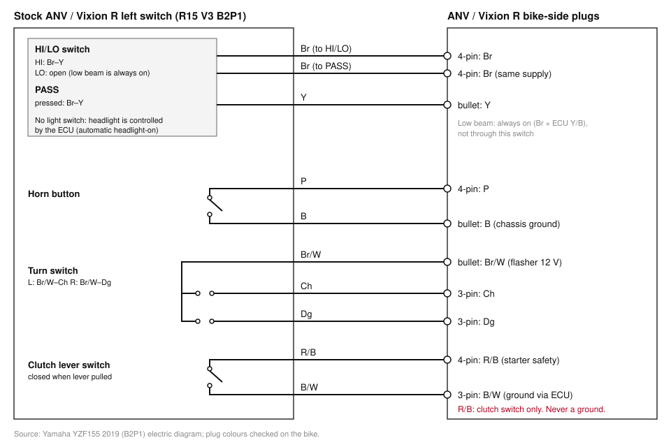
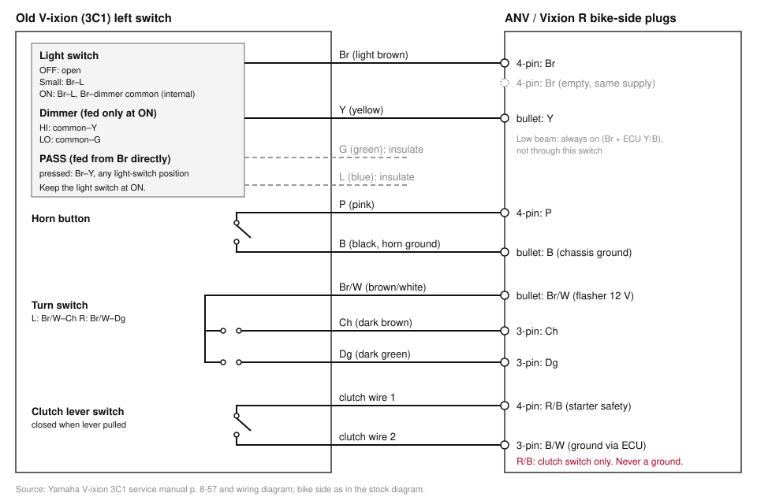
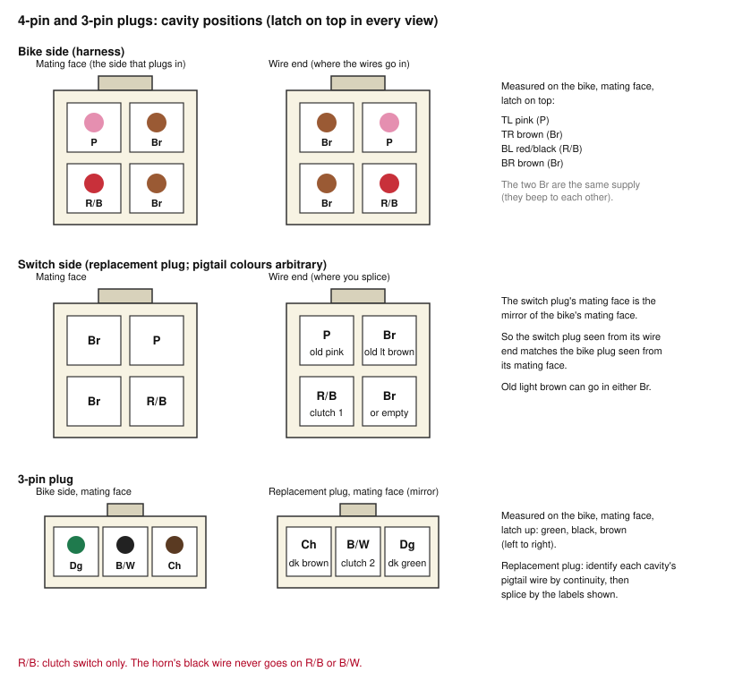

# Vixion: old (3C1) left handlebar switch on All New Vixion / Vixion R

Swap of the 2007 V-ixion (3C1) left switch onto an All New Vixion. The bike-side
harness stays stock; all changes are on the replacement switch's wires.

## Symptoms after the first install (shop, trial and error)

- Headlight always on regardless of the light switch.
- High beam only works with the light switch at ON.
- Horn only works with the light switch at ON, and only in neutral or with the
  clutch pulled.

Causes:

- Headlight always on: by design. On the ANV/R15 V3 the headlamp is fed Br from
  the main harness, and the ECU switches the low beam on its ground side (Y/B).
  No headlight current passes through the left switch.
- High beam needs ON: the old switch feeds the high/low common from the light
  switch's ON contact, inside the housing. That wire never leaves the switch, so
  it cannot be bridged externally.
- Horn needs neutral/clutch: the horn's black (ground) wire was on R/B, the
  starter-safety line, which only reaches ground through the neutral or clutch
  switch.

## Old switch (3C1), from the service manual p. 8-57 and the wiring diagram

| Wire | Function |
|---|---|
| Br | 12 V in: feeds the light switch and PASS |
| L | Small light (light switch at small or ON) |
| Y | High beam (HI from the light switch ON path, or PASS from Br) |
| G | Low beam |
| P | Horn |
| B | Horn ground (button closes P–B) |
| Br/W | 12 V from the flasher |
| Ch | Left signal |
| Dg | Right signal |
| R/B + B | Clutch switch, separate 2-pin plug |

Light switch: OFF = nothing; small = Br–L; ON = Br–L + Br–high/low common.
The YouTube list (i&a channel, T9wMZdShkFc) gives the same 9 body wires.

## Bike side (R15 V3 B2P1 diagram; ANV plug layout matches)

| Plug | Wires |
|---|---|
| 4-pin | Br, Br, P, R/B |
| 3-pin | Ch, B/W, Dg |
| Bullets | Br/W, Y, B |

Stock switch: HI and PASS = Br→Y; there is no LO output (low beam always on);
horn = P→B; clutch = R/B→B/W; turn signals = Br/W→Ch/Dg.

Checked on the bike (switch unplugged, continuity):

- The two Br pins beep to each other: same supply.
- 3-pin black to frame: delayed beep. This is B/W, which grounds through the ECU.
- R/B to frame: no beep in gear or neutral. It's a signal line, not a ground.

Photos of the bike-side plugs: `photos/`.

## Diagrams

Both use the same bike-side pin positions, so they can be compared directly.

Stock switch to bike:

Old switch to bike:

4-pin and 3-pin cavity positions. The shop's replacement plug has non-matching wire
colours, so go by position:

Bike side, measured on the bike (mating face, latch on top): TL pink (P),
TR brown (Br), BL red/black (R/B), BR brown (Br). Resistance, ignition off,
horn connected: P–Br 4 Ω (through the horn coil), R/B–Br 1.3 MΩ (open). The
two Br cavities are interchangeable. 3-pin, bike side, mating face, latch
up: green (Dg), black (B/W), brown (Ch), left to right. To confirm the shop's pigtail wires before soldering:

1. Unplug the horn (so P has no path to Br through the horn coil).
2. Mate the shop's 4-pin plug to the bike plug.
3. Continuity from the bike's pink wire (back-probe at its plug) to each
   loose pigtail wire of the shop's plug: the one that beeps is P.
4. Same with the bike's red wire: the one that beeps is R/B.
5. Tag both pigtail wires, then reconnect the horn.

## Splice map

| Old switch wire | Bike-side pin |
|---|---|
| Br | either Br (4-pin); the other cavity stays empty |
| P | P (4-pin) |
| Clutch switch wire 1 | R/B (4-pin) |
| Clutch switch wire 2 | B/W (3-pin) |
| Ch | Ch (3-pin) |
| Dg | Dg (3-pin) |
| Y | Y bullet |
| Br/W | Br/W bullet |
| B (horn ground) | B bullet; not B/W, which is the ECU ground |
| L, G | insulate, not used |

R/B connects only to the clutch switch. Leave the light switch at ON
permanently; no jumper inside the housing.

## Tests

Old switch, bare wire ends, continuity:

| Action | Pair | Beep |
|---|---|---|
| Nothing pressed | each pair below | no |
| Horn | P–B | yes |
| ON + HI | Br–Y | yes |
| ON + LO | Br–Y | no |
| PASS (any position) | Br–Y | yes |
| Left / right | Br/W–Ch / Br/W–Dg | yes |
| Clutch pulled / released | clutch pair | yes / no |

On the bike after splicing:

- Horn and PASS work in every gear and every light-switch position.
- High beam works at ON.
- Left and right signals blink on the correct side.
- In gear with the clutch released, start must not crank; with the clutch pulled, it must crank.
- Turn the handlebar lock to lock with the engine running: horn, signals and lights must not cut out.

## Splicing

Solder (rosin-core 60/40 or 63/37), stagger the joints, then cover each with heat
shrink. Single-wall heat shrink gets a dab of hot glue inside before shrinking to
seal it. Cable-tie the bundle so the joints don't flex.

## Optional: switchable headlight (not done)

Route the headlamp Br through the old switch (bike Br → switch Br, switch L →
headlamp Br). Then OFF turns off the whole headlamp, including the position
light. This needs an adapter at the 6-pin headlamp plug (Gy, G, Br / –, B, Y).
Daytime headlight is mandatory under UU 22/2009 Pasal 107(2).

## References

Local copies are in `refs/`, which is gitignored (copyrighted material).

- Yamaha V-ixion 3C1 service manual (3C1-F8197): [ManualsLib](https://www.manualslib.com/manual/1210149/Yamaha-V-Ixion.html)
- Yamaha YZF155 2019 (B2P1) electric diagram: [pdfcoffee](https://pdfcoffee.com/wiring-r15-v3-pdf-free.html)
- New Vixion Lightning conversion, earlier generation: [thawil](https://thawil.wordpress.com/2014/01/20/cara-pasang-saklar-old-vixion-pada-new-vixion-revisi/)
- Videos:
  - [T9wMZdShkFc](https://www.youtube.com/watch?v=T9wMZdShkFc): old switch colours
  - [tnLK5tPQGH8](https://www.youtube.com/watch?v=tnLK5tPQGH8): R15 V3 stock switch colours
  - fLPG8PnVSY8, 1KLHclbjGVQ, aEKUrarQQ50 (Rey Sugar): demos of a ready-made conversion, no wiring shown
